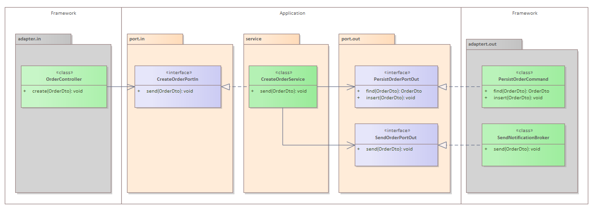
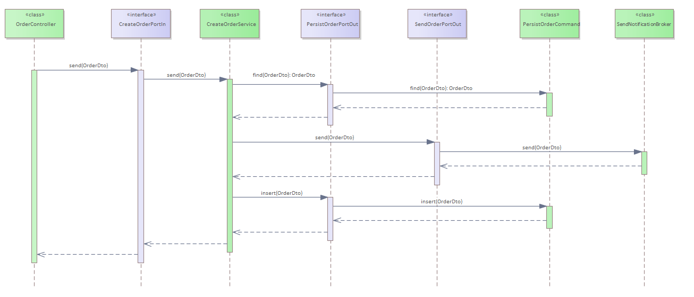

# 1 MS-ORDER  
Serviço para criação de ordem. Publica a mensagem de criação no broker kafka e gavar registro de criação em banco local H2

# 2 Operações   
`create` cria uma ordem e prublica um evento num tópico
`delete` deleta uma ordem
`findById` localiza uma orderm por id
`list` lista todas as ordens
`search` pocura ordems pela descrição
`update` atualiza uma ordem.

# 3 Detalhamento da operação `create`
## 3.1 Diagramas classes  
  


## 3.2 Diagramas sequencia  
  

## 3.3 urls
* [http://localhost:9999/api/order](http://localhost:9999/api/order)  metodo: POST
 
##### 3.3.1 Request 
```bash 
curl -X POST "http://localhost:9999/api/order" -H "accept: */*" -H "Content-Type: application/json" -d  
 "{ \"description\": \"string\", \"id\": 0, \"name\": \"string\", \"status\": \"NOT_PROCESSED\", \"total\": 0}" 
```

##### 3.3.2 Response sucesso
* Sucesso: `http.status=201`  
 
Response body  

```json  
{
  "code": 0,
  "description": "string"
}
```

##### 3.3.3 Response erro
* Erro: `http.status=500`, `http.status=404`, `http.status=403`, `http.status=401` 
 
Response body  

```json  
{
  "code": 0,
  "description": "string"
}
```

# 4 healt-check  
* [http://localhost:9999/actuator](http://localhost:9999/actuator)  
* [http://localhost:9999/h2-console](http://localhost:9999/h2-console)  

# 5 Swagguer-ui  
* [http://localhost:9999/swagger-ui.html](http://localhost:9999/swagger-ui.html)  


